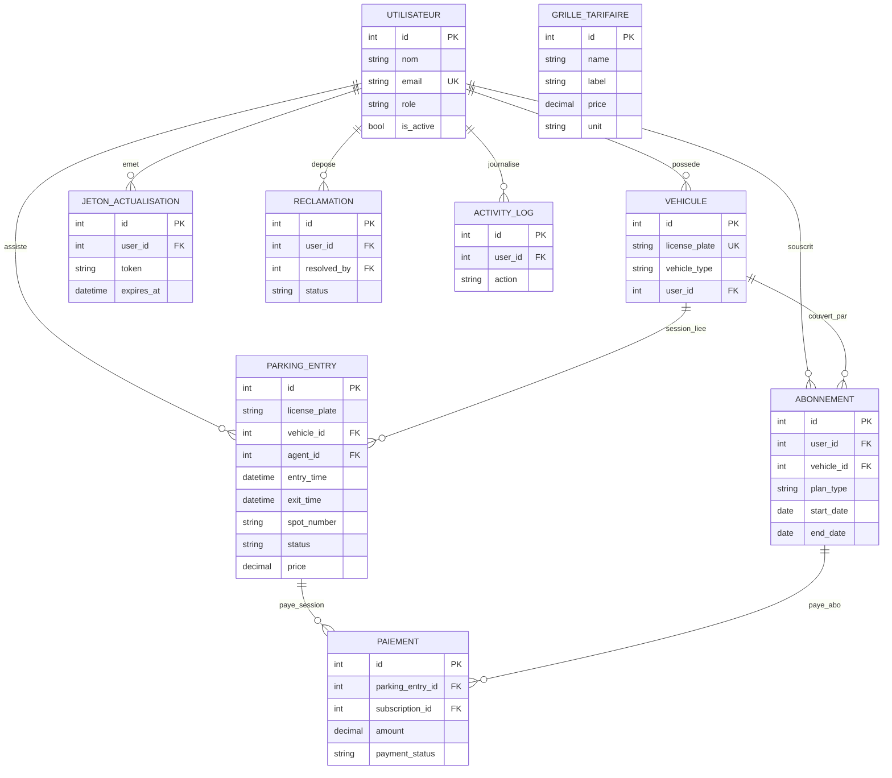

# MCD — Modèle conceptuel de données (IMW Parking)

Schéma aligné sur **`imw-parking_database`** (`backend/database.sql`).

---

## 1. Entités et attributs

| Entité | Identifiant | Autres attributs |
|--------|-------------|-------------------|
| **UTILISATEUR** | id | nom, email, mot de passe, rôle (ADMIN, MANAGER, AGENT, CLIENT), actif, dernière connexion, date création, date mise à jour, date suppression logique |
| **JETON_ACTUALISATION** | id | jeton, date expiration, révoqué, date création |
| **VÉHICULE** | id | immatriculation, type (Voiture, Moto, Camion), actif, dates création / mise à jour |
| **SESSION_STATIONNEMENT** *(entrée/sortie)* | id | immatriculation (redondante utile), horodatage entrée, horodatage sortie, numéro de place, type véhicule, statut (IN, OUT), prix, date création |
| **GRILLE_TARIFAIRE** | id | code technique (name), libellé, prix, unité, actif, dates création / mise à jour |
| **ABONNEMENT** | id | immatriculation, type de plan (HOURLY, DAILY, MONTHLY, ANNUAL), date début, date fin, montant payé, statut, notes, dates création / mise à jour |
| **PAIEMENT** | id | montant, moyen de paiement, statut paiement, référence, date paiement, date création |
| **RÉCLAMATION** | id | sujet, description, statut, date résolution, dates création / mise à jour |
| **TRACE_ACTIVITÉ** *(journal)* | id | action, description, adresse IP, user-agent, date création |

---

## 2. Associations et cardinalités (notation Merise)

Les cardinalités se lisent : **Entité1 (min,max) — Association — (min,max) Entité2**.

| Association | Description | UTILISATEUR | Autre entité |
|-------------|-------------|-------------|--------------|
| **possède** | Compte client → véhicules enregistrés | (0,n) | VÉHICULE (0,1) — un véhicule est lié à au plus un utilisateur |
| **émet** | Jetons de rafraîchissement JWT | (1,n) | JETON_ACTUALISATION (1,1) |
| **enregistre_session** | Véhicule connu lié à une session | (0,1) | SESSION_STATIONNEMENT (0,n) |
| **assiste** | Agent qui enregistre l’entrée/sortie | (0,n) | SESSION_STATIONNEMENT (0,1) |
| **souscrit** | Abonnement souscrit par un client | (1,n) | ABONNEMENT (1,1) |
| **couvre** | Abonnement éventuellement lié à un véhicule | (0,n) | ABONNEMENT (0,1) |
| **règle** | Paiement lié à une session de stationnement | (0,n) | PAIEMENT (0,1) |
| **règle_abo** | Paiement lié à un abonnement | (0,n) | PAIEMENT (0,1) |
| **dépose** | Réclamation déposée par un client | (1,n) | RÉCLAMATION (1,1) |
| **traite** | Résolution par un utilisateur (staff) | (0,n) | RÉCLAMATION (0,1) |
| **journalise** | Ligne de log optionnellement liée à un utilisateur | (0,n) | TRACE_ACTIVITÉ (0,1) |

**GRILLE_TARIFAIRE** : entité **autonome** (aucune FK vers les autres tables) — sert de référence pour l’application des tarifs.

**Remarque** : un **PAIEMENT** peut référencer une **SESSION_STATIONNEMENT** *ou* un **ABONNEMENT** (ou les deux selon les règles métier ; en base les deux clés sont optionnelles).

---

## 3. Diagramme (Mermaid — vue MLD / entité-association)

À afficher dans un éditeur compatible Mermaid (GitHub, VS Code, etc.).

- **GRILLE_TARIFAIRE** : aucune association FK dans le MCD (référentiel autonome).
- **RÉCLAMATION** : `user_id` = auteur du ticket ; `resolved_by` = autre occurrence d’**UTILISATEUR** (résolveur) — représenté par l’attribut `resolved_by` plutôt que par une seconde arête dans ce schéma.

---

## 4. Correspondance MCD → tables SQL

| Entité MCD | Table |
|------------|--------|
| UTILISATEUR | `users` |
| JETON_ACTUALISATION | `refresh_tokens` |
| VÉHICULE | `vehicles` |
| SESSION_STATIONNEMENT | `parking_entries` |
| GRILLE_TARIFAIRE | `pricing_plans` |
| ABONNEMENT | `subscriptions` |
| PAIEMENT | `payments` |
| RÉCLAMATION | `reclamations` |
| TRACE_ACTIVITÉ | `activity_logs` |
